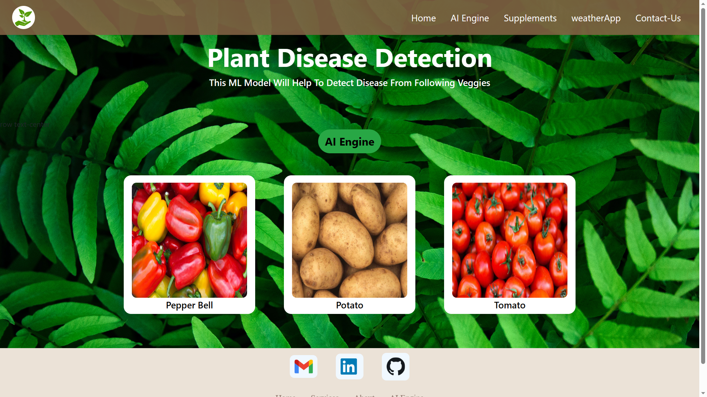
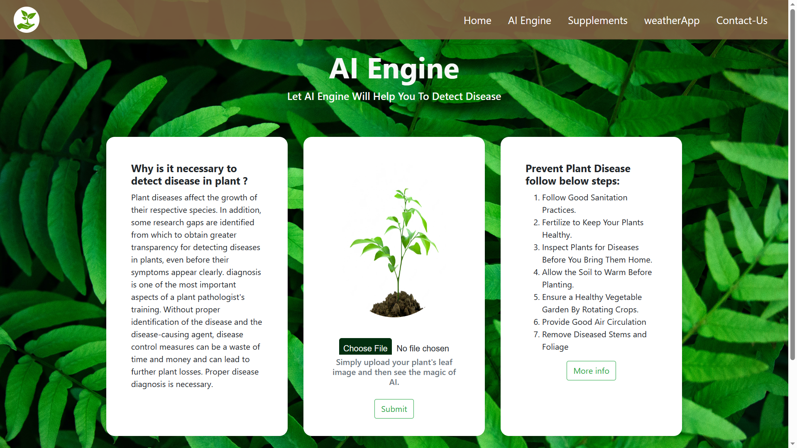
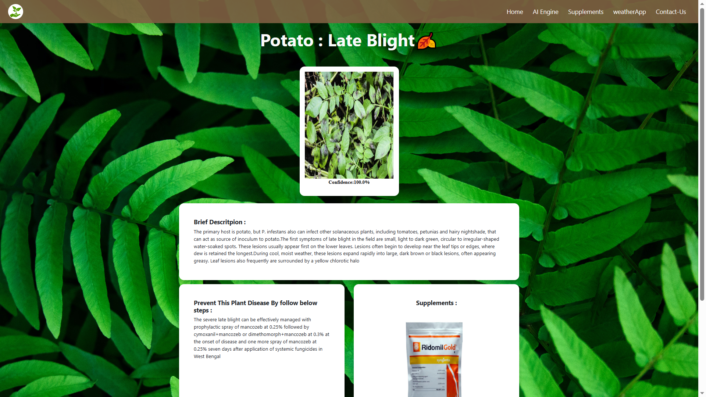

# ⭐ Plant-Disease-Detection-Using-DeepLearning
Crop diseases pose a significant threat to global food security, particularly in areas where 
infrastructure is limited. To address this challenge, a platform for accurate identification of plant 
diseases is needed. "Deep Learning Plant Disease Detection" is a platform that uses deep learning 
techniques to identify plant diseases. The platform uses the "CNN" algorithm, widely known for 
its high accuracy in image classification, enabling it to accurately identify plant diseases from 
images . Furthermore, the platform offers recommendations for preventing and provide 
supplements for that disease and managing the spread of crop diseases using its user-friendly web 
interface. For Training we are using Plant village dataset

## ⭐Testing Images

* If you do not have leaf images then you can use test images located in test_images folder
* Each Image have it's disease name so you can verify model is working perfact or not.

## ⭐Snippet of Web App :
#### Main page
  
#### AI Engine 
  
#### Results Page 
  
#### Supplements/Fertilizer  Store
  
#### Contact Us 
   
